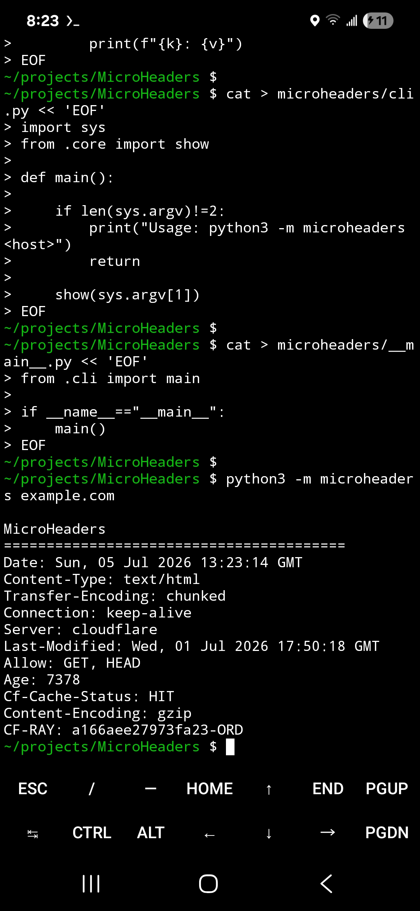

# MicroHeaders

Greenfield Micro Suite command-line utility.

## Install

```bash
pip install microheaders
```

## Run

```bash
microheaders
```

## License

MIT

---

## Overview

A lightweight utility for inspecting HTTP response headers.

## Features

- Lightweight command-line interface
- Educational output
- Minimal dependencies
- Cross-platform Python implementation
- Designed for learning and experimentation

## Educational Concepts

- HTTP headers
- Web protocols
- Content negotiation
- Security headers

## Roadmap

- Improved formatting
- Additional command-line options
- Expanded educational examples

## License

MIT License


---

## Screenshot



